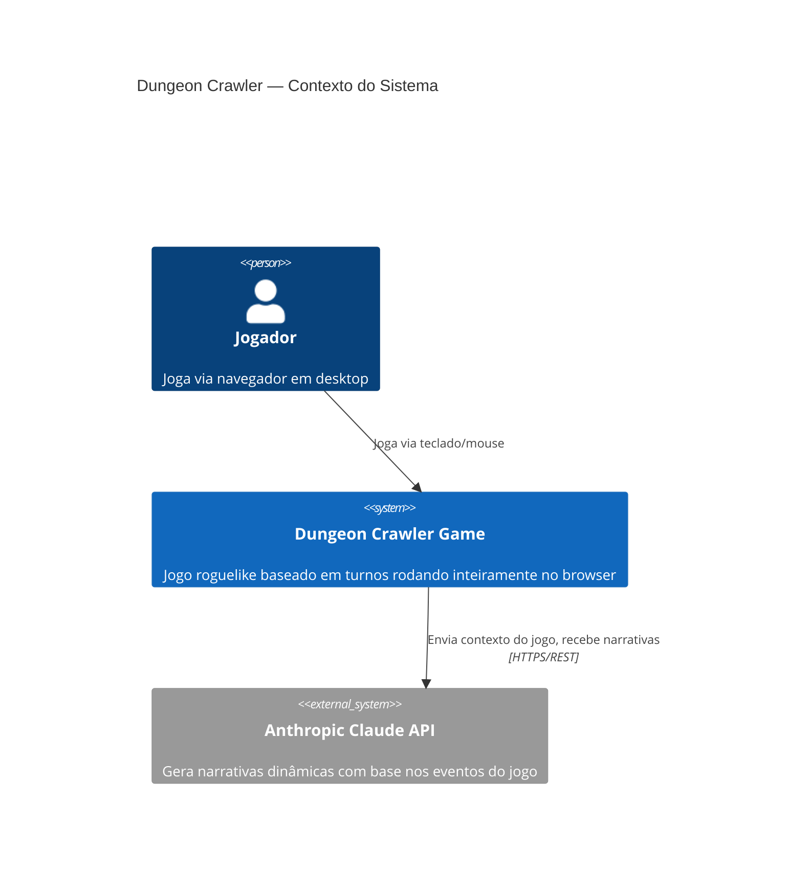
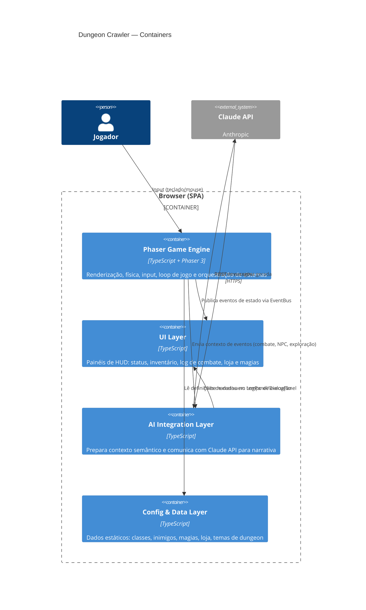

# C4 Architecture — Dungeon Crawler

> Modelo C4 em três níveis de zoom. Renderiza automaticamente no GitHub e no VSCode (extensão Mermaid Preview).

---

## L1 — System Context

Visão de alto nível: o sistema no mundo, quem usa e com o que se integra.

---

## L2 — Container

Zoom no sistema: processos, camadas tecnológicas e suas responsabilidades.

---

## L3 — Component

Zoom na camada Phaser Game: os sistemas internos e como se comunicam.

```mermaid
C4Component
    title Dungeon Crawler — Componentes Internos

    Container_Boundary(phaser, "Phaser Game Engine") {

        Component(gamescene, "GameScene", "Scene principal", "Orquestra todos os sistemas; loop de update por turno")
        Component(uiscene, "UIScene", "Scene de UI paralela", "Renderiza HUD em overlay — status, log, painéis")

        Component(turn, "TurnManager", "Sistema", "Controla a ordem de turnos: jogador → inimigos")
        Component(combat, "CombatSystem", "Sistema", "Resolve ataques, dano, status e morte")
        Component(spell, "SpellSystem / SpellCastingSystem", "Sistema", "Catálogo de magias, cooldowns e lançamento")
        Component(enemy, "EnemySystem / EnemyAI", "Sistema", "Spawn, pathfinding e decisão de ação dos inimigos")

        Component(dungeon, "DungeonGenerator / DungeonFloorManager", "Gerador", "Geração procedural de mapas e gerenciamento de andares")
        Component(world, "WorldSystem / MapTransitionSystem", "Sistema", "Gerencia estados do mundo: cidade, dungeon e transições")
        Component(fog, "FogOfWarSystem", "Sistema", "Controla tiles visíveis e memória do mapa explorado")

        Component(inventory, "InventorySystem / LootSystem / ShopSystem", "Sistema", "Gerencia itens, drops e compras na loja")
        Component(equipment, "EquipmentSystem / ClassRulesEngine", "Sistema", "Aplica bônus de equipamentos respeitando regras de classe")
        Component(xp, "XPSystem / DifficultyManager", "Sistema", "Progressão de XP, level-up e escalonamento de dificuldade")

        Component(events, "EventBus / EventMemory", "Infraestrutura", "Pub/sub desacoplado entre sistemas; histórico de eventos")
        Component(ai_int, "AIIntegration / NarrativeService", "IA", "Classifica eventos semanticamente e solicita narrativa ao Claude")
        Component(metrics, "PlayerMetrics / LogSystem", "Observabilidade", "Registra ações do jogador e logs de combate")
    }

    Rel(gamescene, turn, "Dispara tick de turno")
    Rel(turn, combat, "Processa ação do jogador")
    Rel(turn, enemy, "Processa turno de cada inimigo")
    Rel(combat, xp, "Concede XP ao matar inimigo")
    Rel(combat, events, "Publica CombatEvent")
    Rel(enemy, events, "Publica EnemyEvent")
    Rel(events, ai_int, "Fornece histórico de eventos como contexto")
    Rel(events, metrics, "Alimenta métricas e log")
    Rel(gamescene, dungeon, "Solicita geração de novo andar")
    Rel(gamescene, world, "Solicita transição de mapa")
    Rel(gamescene, fog, "Atualiza visibilidade após movimento")
    Rel(gamescene, inventory, "Processa coleta de loot e abertura de loja")
    Rel(inventory, equipment, "Aplica item equipado ao personagem")
    Rel(uiscene, events, "Escuta eventos para atualizar HUD")
    Rel(ai_int, uiscene, "Envia narrativa para exibição no LogPanel")
```

---

## Referências

- [C4 Model](https://c4model.com) — Simon Brown
- [Mermaid C4 Diagram docs](https://mermaid.js.org/syntax/c4.html)
