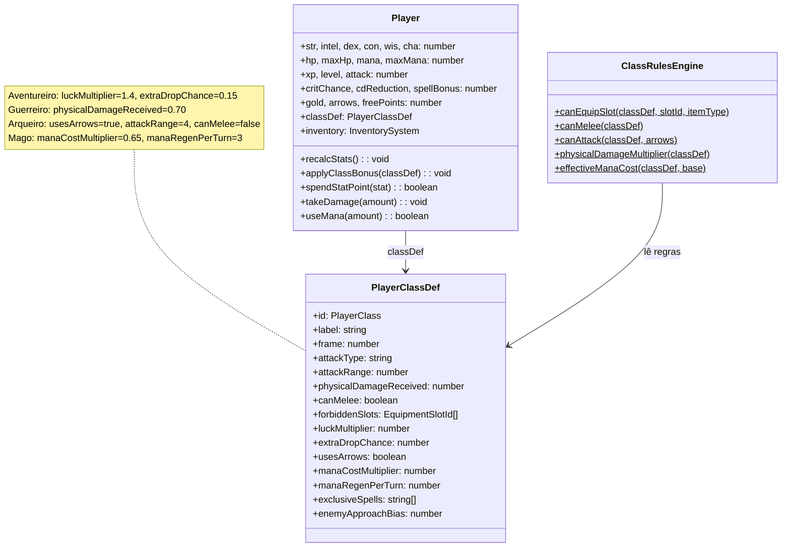
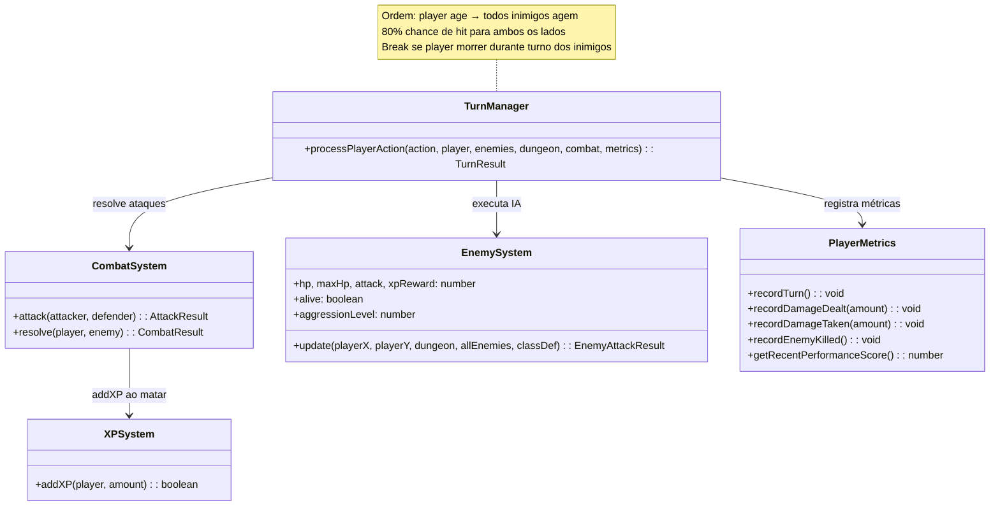
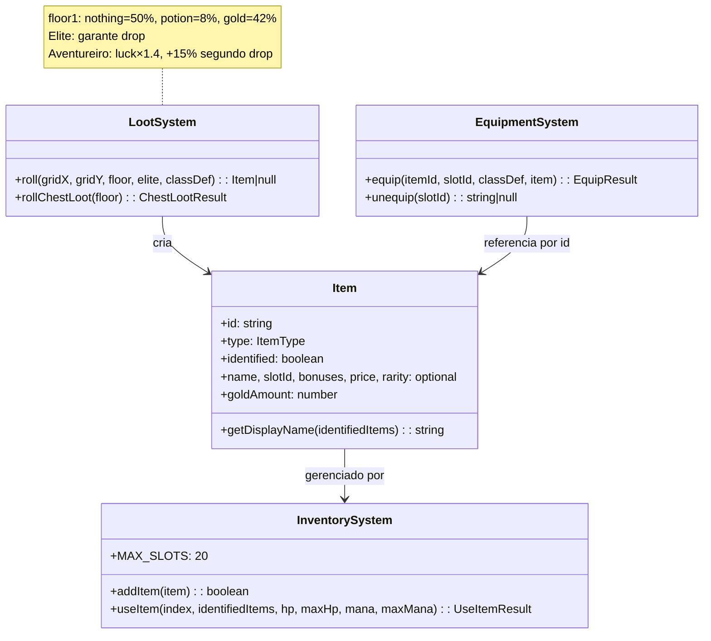
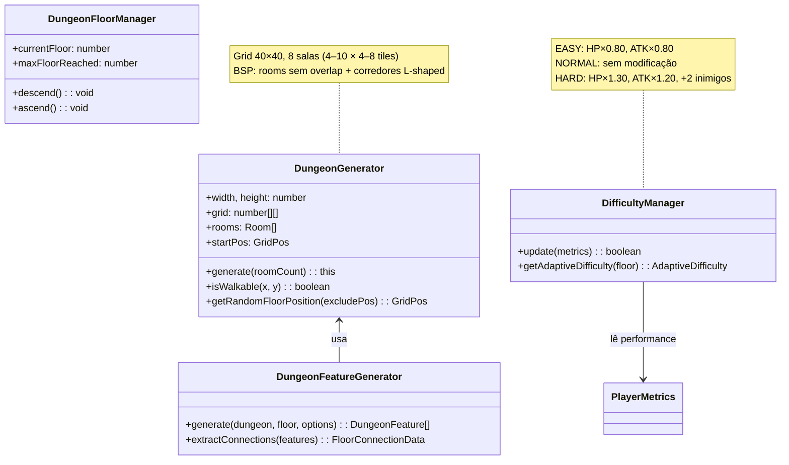
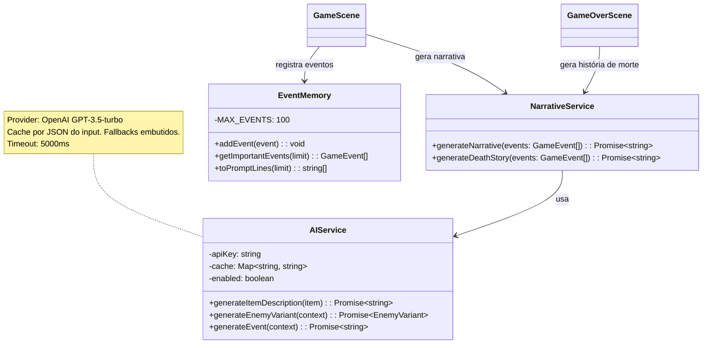
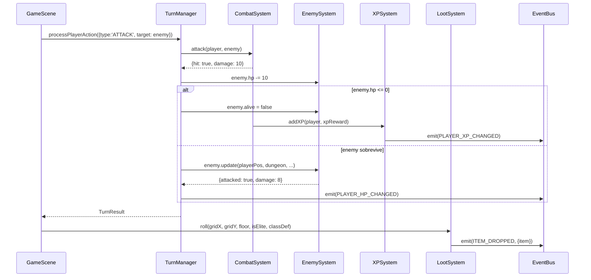
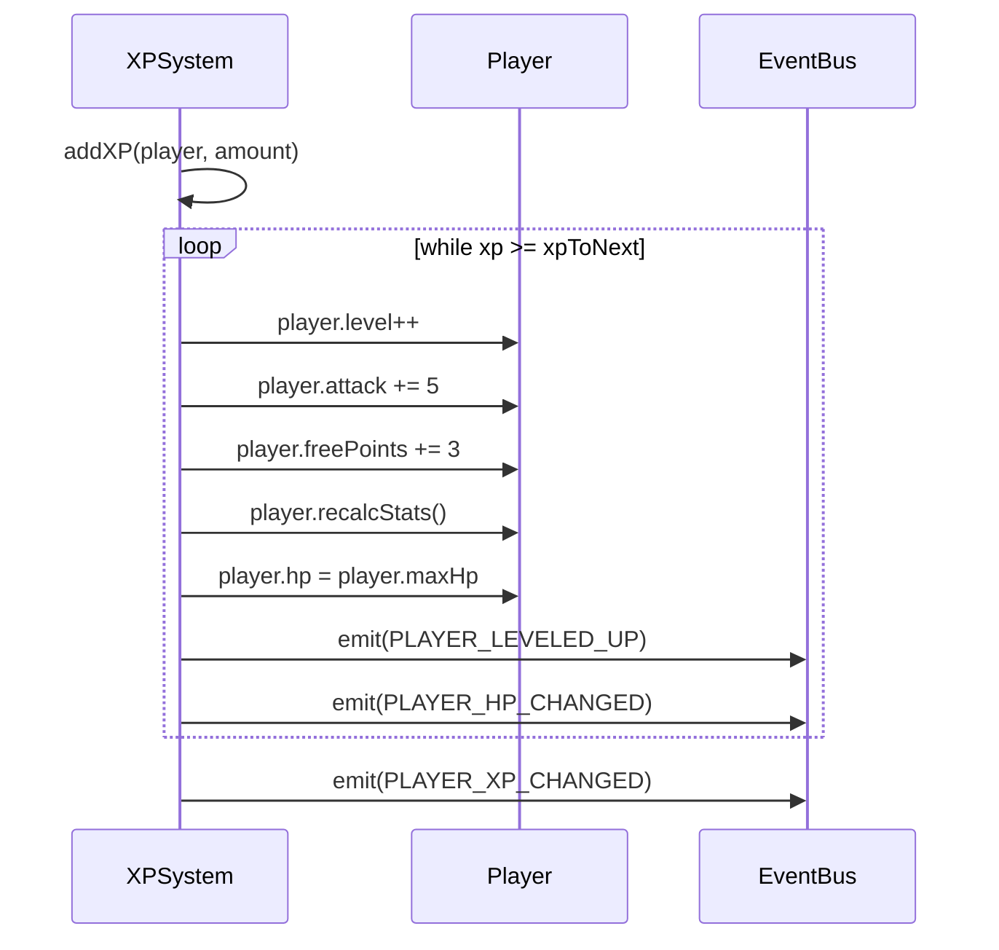
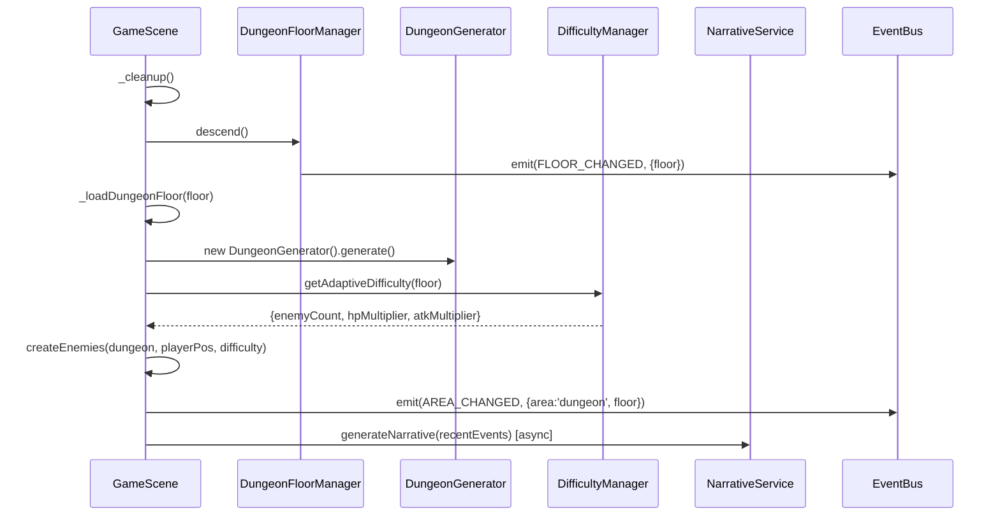

# Dungeon of Echoes — Diagrama de Classes

> Documento gerado a partir da leitura direta do código-fonte em `src/`. Versão 0.6.0.
> Todos os nomes de classes, métodos e campos são reais — sem inferência.

---

## 1. Visão Geral Arquitetural

### Camadas do Projeto

```
┌────────────────────────────────────────────────────────────────┐
│                     PHASER GAME (main.ts)                      │
│  Phaser.Game { config: 800×600, arcade physics, pixelArt }    │
└───────────────────────┬────────────────────────────────────────┘
                        │ scene pipeline
          ┌─────────────┼──────────────────────────┐
          │             │                          │
    BootScene   GameScene (+ UIScene paralela)  GameOverScene
    MainMenuScene  CharacterSelectScene  CreditsScene
          │
          │ instancia / usa
   ┌──────┴──────────────────────────────────────────────────┐
   │                      SYSTEMS                            │
   │  TurnManager  CombatSystem  XPSystem  LootSystem        │
   │  EquipmentSystem  SpellSystem  SpellCastingSystem       │
   │  ShopSystem  InventorySystem  InputModeManager          │
   │  MapTransitionSystem  DungeonFloorManager               │
   │  DifficultyManager  DifficultyScalingSystem             │
   │  PlayerMetrics  EnemySystem  NPCController              │
   │  InteractiveObjectSystem  LogSystem  EventMemory        │
   │  ClassRulesEngine  WorldSystem                          │
   └──────┬──────────────────────────────────────────────────┘
          │ opera sobre
   ┌──────┴──────────────────────────────────────────────────┐
   │                      ENTITIES                           │
   │  Player  EnemySystem  Item  Projectile                  │
   └──────┬──────────────────────────────────────────────────┘
          │ gerado por
   ┌──────┴──────────────────────────────────────────────────┐
   │                     GENERATORS                          │
   │  DungeonGenerator  DungeonFeatureGenerator              │
   │  TileVariantResolver  CityLayoutProcessor               │
   └──────┬──────────────────────────────────────────────────┘
          │ configuração em
   ┌──────┴──────────────────────────────────────────────────┐
   │                      CONFIG / DATA                      │
   │  PLAYER_CLASSES  SPELLS_DB  SPELL_PROGRESSION           │
   │  SHOP_CATALOG  ENEMY_DEFS  dungeon-themes               │
   │  difficulty.config  sprites-config  TownTMXData         │
   └──────┬──────────────────────────────────────────────────┘
          │ comunicação via
   ┌──────┴──────────────────────────────────────────────────┐
   │                      UTILS                              │
   │  EventBus  constants (EVENTS, TILE_SIZE, etc.)          │
   └─────────────────────────────────────────────────────────┘
```

### Módulos por Diretório

| Diretório | Papel |
|-----------|-------|
| `src/scenes/` | Cenas Phaser: orquestram lifecycle e composição de sistemas |
| `src/entities/` | Objetos de domínio com estado e comportamento mínimo |
| `src/systems/` | Lógica de negócio do jogo, stateful ou stateless |
| `src/generators/` | Geração procedural (dungeon, features, tiles) |
| `src/config/` | Dados de configuração (constantes complexas, catálogos) |
| `src/ui/` | Painéis de UI renderizados pela UIScene |
| `src/ai/` | Integração com LLM para narrativa emergente |
| `src/types/` | Interfaces e tipos TypeScript compartilhados |
| `src/utils/` | Utilitários globais: EventBus e constants |

---

## 2. Diagrama de Classes Completo (Mermaid)

```mermaid
classDiagram

  %% ─── ENTITIES ───────────────────────────────────────────────────

  class Player {
    +gridX: number
    +gridY: number
    +str: number
    +intel: number
    +dex: number
    +con: number
    +wis: number
    +cha: number
    +hp: number
    +maxHp: number
    +mana: number
    +maxMana: number
    +xp: number
    +level: number
    +attack: number
    +critChance: number
    +cdReduction: number
    +spellBonus: number
    +gold: number
    +freePoints: number
    +unlockedSpells: string[]
    +equippedSpells: [string|null, string|null]
    +facingDir: Direction
    +classDef: PlayerClassDef
    +arrows: number
    +inventory: InventorySystem
    +identifiedItems: Record~string, boolean~
    +applySkin(frame: number): void
    +recalcStats(): void
    +applyEquipmentBonuses(bonuses: StatBonuses): void
    +removeEquipmentBonuses(bonuses: StatBonuses): void
    +tryMove(dx, dy, dungeon, enemies, now): MoveResult
    +takeDamage(amount: number): void
    +applyClassBonus(classDef: PlayerClassDef): void
    +spendStatPoint(stat: string): boolean
    +useMana(amount: number): boolean
    +getPixelPos(): PixelPos
    +reset(gridX, gridY): void
  }

  class EnemySystem {
    +id: number
    +hp: number
    +maxHp: number
    +attack: number
    +xpReward: number
    +gridX: number
    +gridY: number
    +alive: boolean
    +state: EnemyState
    +detectionRadius: number
    +aggressionLevel: number
    +isElite: boolean
    +category: EnemyCategory
    +frameIndex: number
    +animKey: string
    +sprite: Phaser.GameObjects.Sprite|null
    +update(playerX, playerY, dungeon, allEnemies, classDef): EnemyAttackResult
    +takeDamage(amount, emitter): void
    +getPixelPos(): PixelPos
  }

  class Item {
    +id: string
    +type: ItemType
    +identified: boolean
    +gridX: number|null
    +gridY: number|null
    +name: string
    +slotId: EquipmentSlotId
    +bonuses: StatBonuses
    +price: number
    +rarity: ItemRarity
    +noSell: boolean
    +noUnequip: boolean
    +goldAmount: number
    +getDisplayName(identifiedItems): string
  }

  class Projectile {
    +damage: number
    +spell: SpellDef
    +updateMovement(dungeon: DungeonGenerator): void
    +checkEnemyHit(enemy: Enemy): boolean
    +isAlive(): boolean
  }

  %% ─── SYSTEMS ────────────────────────────────────────────────────

  class XPSystem {
    +addXP(player: PlayerLike, amount: number): boolean
    +getXPToNextLevel(level: number): number
  }

  class CombatSystem {
    +attack(attacker, defender): AttackResult
    +resolve(player, enemy): CombatResult|null
  }

  class TurnManager {
    +isPlayerTurn(): boolean
    +processPlayerAction(action, player, enemies, dungeon, combat, metrics): TurnResult
  }

  class LootSystem {
    +roll(gridX, gridY, floor, elite, classDef): Item|null
    +rollChestLoot(floor: number): ChestLootResult
  }

  class InventorySystem {
    +isFull(): boolean
    +count(): number
    +addItem(item: Item): boolean
    +removeItem(index: number): Item|null
    +useItem(index, identifiedItems, hp, maxHp, mana, maxMana): UseItemResult
    +reset(): void
  }

  class EquipmentSystem {
    +equip(itemId, slotId, classDef, item): EquipResult
    +unequip(slotId: EquipmentSlotId): string|null
    +getEquippedId(slotId): string|null
    +isEquipped(itemId): boolean
    +getAllEquipped(): Record~EquipmentSlotId, string|null~
    +reset(): void
  }

  class SpellSystem {
    +unlockSpellsForLevel(player, level): string[]
    +equipSpell(player, spellId, slotIndex): boolean
    +canCast(slotIndex, nowMs): boolean
    +recordCast(slotIndex, nowMs): void
    +getCooldownRatio(slotIndex, nowMs): number
    +syncFromPlayer(player): void
  }

  class SpellCastingSystem {
    +cast(slotIndex, player, spellSystem, enemies, nowMs): SpellCastResult|null
  }

  class ShopSystem {
    +buyItem(player, index, inventory): BuyResult
    +sellItem(player, itemIndex, inventory): SellResult
    +buildViewModel(player, selectedIndex, tab, inventory, equippedIds): ShopViewModel
  }

  class ClassRulesEngine {
    +canEquipSlot(classDef, slotId, itemType)$
    +canMelee(classDef)$
    +canAttack(classDef, arrows)$
    +physicalDamageMultiplier(classDef)$
    +luckMultiplier(classDef)$
    +effectiveManaCost(classDef, base)$
    +effectiveDetectionRadius(classDef, base)$
  }

  class DungeonFloorManager {
    +currentFloor: number
    +maxFloorReached: number
    +descend(): void
    +ascend(): void
    +saveFloorConnections(floor, data): void
    +getFloorConnections(floor): FloorConnectionData|null
    +reset(): void
  }

  class MapTransitionSystem {
    +registerSpawn(point): void
    +registerTransition(point): void
    +requestTransition(transitionId): TransitionResolution|null
    +completeTransition(resolution): void
  }

  class DifficultyManager {
    +currentLevel: DifficultyLevel
    +update(metrics: PlayerMetrics): boolean
    +getAdaptiveDifficulty(floor): AdaptiveDifficulty
    +reset(): void
  }

  class PlayerMetrics {
    +turnsSurvived: number
    +damageDealt: number
    +damageTaken: number
    +enemiesKilled: number
    +itemsUsed: number
    +deaths: number
    +recordTurn(): void
    +recordDamageDealt(amount): void
    +recordDamageTaken(amount): void
    +recordEnemyKilled(): void
    +recordItemUsed(): void
    +recordDeath(): void
    +getRecentPerformanceScore(): number
  }

  class InputModeManager {
    +push(mode): void
    +pop(): void
    +is(mode): boolean
    +current(): InputMode
  }

  class EventMemory {
    +addEvent(event: GameEvent): void
    +getRecentEvents(limit): GameEvent[]
    +getImportantEvents(limit): GameEvent[]
    +reset(): void
    +toPromptLines(limit): string[]
  }

  class LogSystem {
    +bindEventBus(): void
    +add(message): void
    +getVisible(count): string[]
  }

  %% ─── GENERATORS ─────────────────────────────────────────────────

  class DungeonGenerator {
    +width: number
    +height: number
    +grid: number[][]
    +rooms: Room[]
    +startPos: GridPos
    +generate(roomCount): this
    +isWalkable(x, y): boolean
    +getRandomFloorPosition(excludePos): GridPos
  }

  class DungeonFeatureGenerator {
    +generate(dungeon, floor, options): DungeonFeature[]
    +extractConnections(features): FloorConnectionData
  }

  %% ─── AI ─────────────────────────────────────────────────────────

  class AIService {
    +generateItemDescription(item): Promise~string~
    +generateEnemyVariant(context): Promise~EnemyVariant~
    +generateEvent(context): Promise~string~
  }

  class NarrativeService {
    +generateNarrative(events: GameEvent[]): Promise~string~
    +generateDeathStory(events: GameEvent[]): Promise~string~
  }

  %% ─── SCENES ─────────────────────────────────────────────────────

  class GameScene {
    -player: Player
    -xpSystem: XPSystem
    -combatSystem: CombatSystem
    -turnManager: TurnManager
    -lootSystem: LootSystem
    -playerMetrics: PlayerMetrics
    -difficultyManager: DifficultyManager
    -equipmentSystem: EquipmentSystem
    -_spellSystem: SpellSystem
    -_spellCastingSystem: SpellCastingSystem
    -_eventMemory: EventMemory
    -_narrativeService: NarrativeService
    -_dungeonCache: Map~number, DungeonState~
    -_enemies: EnemySystem[]
    -_items: Item[]
    +create(): void
    +update(time, delta): void
  }

  class UIScene {
    -_logSystem: LogSystem
    -_inventoryPanel: InventoryPanel
    -_statusPanel: StatusPanel
    -_spellsPanel: SpellsPanel
    -_shopPanel: ShopPanel
    -_dialogPanel: DialogPanel
    -_actionBar: ActionBarPanel
    +create(): void
  }

  class GameOverScene {
    -playerData: GameOverData
    -_storyText: Phaser.GameObjects.Text
    +init(data: GameOverData): void
    +create(): void
    +shutdown(): void
  }

  %% ─── RELAÇÕES ───────────────────────────────────────────────────

  GameScene --> Player : cria e controla
  GameScene --> EnemySystem : cria via createEnemies()
  GameScene --> XPSystem : usa
  GameScene --> CombatSystem : usa
  GameScene --> TurnManager : usa
  GameScene --> LootSystem : usa
  GameScene --> EquipmentSystem : usa
  GameScene --> SpellSystem : usa
  GameScene --> SpellCastingSystem : usa
  GameScene --> ShopSystem : usa
  GameScene --> DungeonFloorManager : usa
  GameScene --> MapTransitionSystem : usa
  GameScene --> DifficultyManager : usa
  GameScene --> PlayerMetrics : usa
  GameScene --> DungeonGenerator : instancia
  GameScene --> DungeonFeatureGenerator : usa
  GameScene --> EventMemory : usa
  GameScene --> NarrativeService : usa

  Player --> InventorySystem : possui
  TurnManager --> CombatSystem : usa
  TurnManager --> ClassRulesEngine : usa
  TurnManager --> PlayerMetrics : usa
  CombatSystem --> XPSystem : usa
  LootSystem --> ClassRulesEngine : usa
  EnemySystem --> ClassRulesEngine : usa
  EquipmentSystem --> ClassRulesEngine : usa
  SpellSystem --> ClassRulesEngine : usa
  DifficultyManager --> PlayerMetrics : lê
  NarrativeService --> AIService : usa
  GameOverScene --> NarrativeService : usa
```



---

## 3. Diagramas por Contexto

### 3.1 Player e Atributos



### 3.2 Combate



### 3.3 Loot e Itens



### 3.4 Dungeon e Geração



### 3.5 IA Narrativa



---

## 4. Diagramas de Sequência

### 4.1 Combate Completo



### 4.2 Level Up



### 4.3 Troca de Andar (Descida)



---

## 5. Mapa de Dependências

### Classes Centrais (Alto Acoplamento)

| Classe | Depende de | Dependida por |
|--------|-----------|--------------|
| `GameScene` | Todos os sistemas | Nenhuma (raiz) |
| `ClassRulesEngine` | `PlayerClassDef` | `TurnManager`, `EnemySystem`, `LootSystem`, `EquipmentSystem`, `SpellSystem` |
| `EventBus` | Nenhuma | `Player`, `XPSystem`, `LootSystem`, `EquipmentSystem`, `SpellSystem`, `UIScene` |
| `Player` | `InventorySystem`, `EventBus`, `PlayerClassDef` | `GameScene`, `TurnManager`, `CombatSystem` |

### Classes Isoladas (Baixo Acoplamento)

| Classe | Motivo |
|--------|--------|
| `DungeonGenerator` | Sem dependências externas além de `constants.ts` |
| `InventorySystem` | Depende apenas de `Item` e `INVENTORY` constant |
| `EventMemory` | Sem dependências externas |
| `ClassRulesEngine` | Stateless, depende apenas de `PlayerClassDef` |

### Classes Críticas (Ponto de Falha)

| Classe | Risco |
|--------|-------|
| `EventBus` | Singleton global. Falha silenciosa em `off()` sem `fn`. |
| `GameScene` | Classe Deus (~1000 linhas). Falha afeta tudo. |
| `TurnManager` | `playerTurn` não é thread-safe. |
| `_dungeonCache` | Não serializa inimigos — ressurgimento ao revisitar. |

---

## 6. Guia de Evolução Arquitetural

### Problema 1: GameScene como Classe Deus

**Refatoração sugerida:**
```
GameScene (orquestrador)
  ├── AreaManager (town / dungeon / bonus)
  │     ├── TownAreaController
  │     ├── DungeonAreaController
  │     └── BonusAreaController
  ├── InputController
  ├── RenderBatch
  └── SessionState
```

### Problema 2: EventBus sem Contrato de Tipo

**Refatoração sugerida:**
```typescript
type EventPayloads = {
  'player-hp-changed': { hp: number; maxHp: number };
  'player-xp-changed': { xp: number; xpNext: number };
};

class TypedEventBus {
  emit<K extends keyof EventPayloads>(event: K, payload: EventPayloads[K]): void
  on<K extends keyof EventPayloads>(event: K, fn: (data: EventPayloads[K]) => void): void
}
```

### Problema 3: Serialização de Estado de Dungeon

Para corrigir o ressurgimento de inimigos:
1. Adicionar `enemies: EnemySystemSnapshot[]` ao `DungeonState`.
2. `EnemySystemSnapshot` = `{ id, hp, alive, gridX, gridY }`.
3. Em `_loadDungeonFloor`: se cache tem inimigos mortos, não criar sprite para eles.

### Problema 4: Reinício sem Classe

`GameOverScene._restart()` chama `scene.start('GameScene')` sem `{ playerClass }`.

**Fix:** Armazenar a classe escolhida em `GameOverData` e repassar no restart:
```typescript
private _restart(): void {
  this.scene.start('CharacterSelectScene'); // ou passar classe salva
}
```
